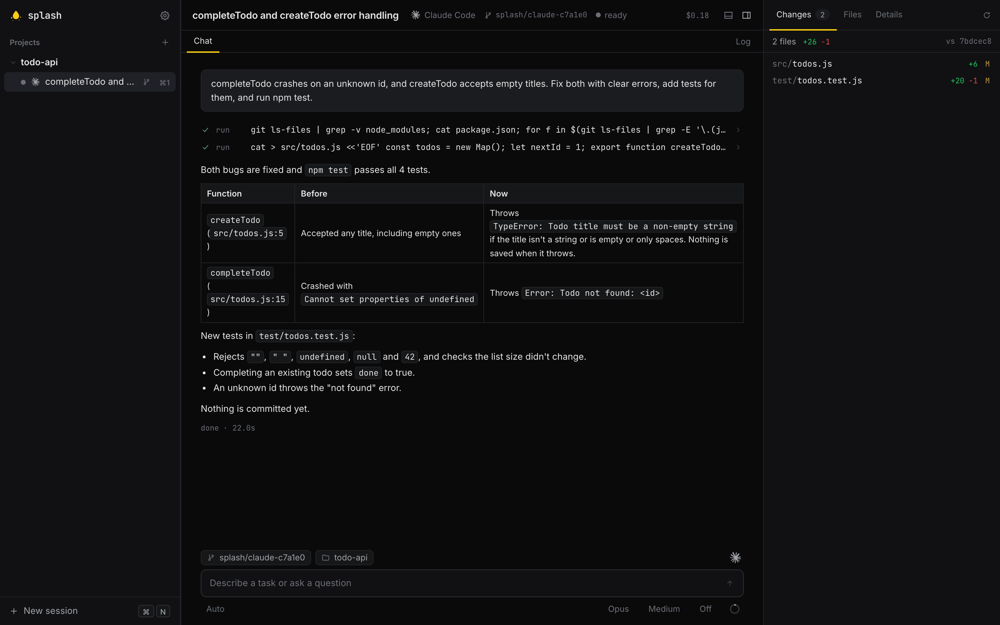
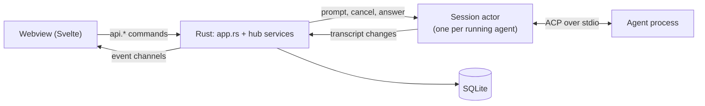

<p align="center">
  
</p>

<h1 align="center">Splash</h1>

<p align="center">
  A desktop app for running coding agents such as Claude Code, Codex and Gemini CLI in your git projects.
</p>

<p align="center">
  <a href="https://github.com/HelgeSverre/splash/actions/workflows/ci.yml"></a>
  
  
  <a href="LICENSE"></a>
</p>



Splash talks to agents over the [Agent Client Protocol](https://agentclientprotocol.com) (ACP), a JSON-RPC protocol many coding agents implement for use in editors. It starts the agent as a child process, sends it your prompts and shows what it streams back: messages, tool calls, diffs, plans and permission requests.

Each session is one agent working in one project folder. It runs in the folder itself or, in a git repository, in a separate worktree: a second checkout of the repo on its own branch.

Splash is an early personal project, developed and tested on macOS only.

## Getting started

### Download the app

On an Apple silicon Mac running macOS 14 Sonoma or later, download the ZIP from [Releases](https://github.com/HelgeSverre/splash/releases),
extract it, and move **Splash.app** to **Applications**. Release apps are Developer
ID signed and notarized. A SHA-256 checksum is included with each download.

Install and sign in to at least one [supported agent](#agents) before starting a
session. Git is required for worktrees; Node.js and npm are needed for agents
launched through `npx`. The app itself does not require Rust or just.

### Build from source

Requirements:

- macOS, git, a stable Rust toolchain (rustup), Node.js 20.19+ or 22.12+, and [just](https://github.com/casey/just).
- At least one agent from the [table below](#agents), installed and signed in.
- Optional: `gh`, to show a branch's pull request.

```bash
git clone https://github.com/HelgeSverre/splash.git
cd splash
just setup                  # frontend dependencies, and rata (Elyra's CLI, built with cargo)
just run                    # build the frontend and start the app
just run ~/code/some-repo   # the same, adding a folder as a project
```

The first build compiles all Rust dependencies and takes a few minutes. In the app, add a project folder, press ⌘N to open the new-session dialog, pick an agent, and send a prompt. `just detect` lists which agents Splash can find and whether they answer.

Data lives in `~/Library/Application Support/Splash`. Set `SPLASH_DATA_DIR` to use another folder.

## Features

- **Sessions.** In place or in a worktree on a `splash/…` branch. Archiving or deleting removes the worktree and keeps the branch. Both require an explicit discard confirmation if there are uncommitted changes; deleting also removes the transcript.
- **Transcript.** Markdown with syntax highlighting, collapsible thinking, tool calls with status and diffs, plans as checklists, and permission requests answered with the 1–9 keys.
- **Agent controls.** Model, mode and effort pickers when the agent offers them, slash-command completion, and context and cost readouts when the agent reports them.
- **Workbench.** A side panel with the session's git changes, a file tree and session details; diff and file tabs; a terminal in the session folder (⌘J).
- **Resume.** Sessions are saved in SQLite. Agents that support `session/load` continue the same conversation after a restart. Otherwise, or if loading fails, a new agent session starts and the transcript marks the break.
- **Settings.** Per-agent status and version, a connection test that sends no prompt, extra launch arguments, read-only lists of each agent's skills, commands and MCP servers, and rebindable shortcuts.
- **Log.** Each session's JSON-RPC traffic, kept in memory for the current run.

## Agents

Splash does not install agents or sign in to them. Install and authenticate each CLI yourself; the `npx` adapters are downloaded by npx the first time they run. Splash can tell that an agent is signed out only for Claude Code, Codex, Glue and Pool. For the others, the connection test or the first session shows it.

<details>
<summary>Launch commands (19 agents)</summary>

| Agent | Launch command |
|---|---|
| Claude Code | `npx -y @agentclientprotocol/claude-agent-acp@0.81.1` |
| Codex | `npx -y @agentclientprotocol/codex-acp@1.13.1` |
| Glue | `glue acp` |
| Autohand | `npx -y @autohandai/autohand-acp@0.2.1` |
| Copilot | `copilot --acp` |
| Devin | `devin acp` |
| Dirac | `dirac --acp` |
| Droid | `droid exec --output-format acp-daemon` |
| Gemini | `gemini --acp` |
| Goose | `goose acp` |
| Hermes | `hermes acp` |
| Junie | `junie --acp=true` |
| Kimi | `kimi acp` |
| Letta | `npx -y @letta-ai/letta-acp@0.1.11` |
| OpenCode | `opencode acp` |
| OpenHands | `openhands acp` |
| Pi | `npx -y pi-acp@0.0.33` |
| Pool | `pool acp` |
| Vibe | `vibe-acp` |

</details>

The `npx` entries are adapters around the vendor's CLI; the rest are the CLIs' own ACP modes. The list and pinned versions are in `src/agents/registry.rs`. Agents report different things (models, modes, commands, usage), so not every control appears for every agent.

## How it works

Splash is built with [Elyra](https://github.com/kwhorne/elyra-framework): a Rust process with a Svelte 5 frontend in a webview.



1. **UI and backend.** The UI calls Rust `#[command]` functions through a typed `api.*` facade and listens on Elyra event channels. `rata codegen` generates both into `app/src/bindings.ts`.
2. **Starting an agent.** Opening a session starts its agent. `acp/transport.rs` runs the launch command in the session folder, in its own process group, with your login shell's `PATH`. Its stdin and stdout carry ACP through the [`agent-client-protocol`](https://crates.io/crates/agent-client-protocol) crate. Splash offers no file-system or terminal capabilities to the agent: the agent edits files itself, and Splash sees the results through git and a file watcher.
3. **The session actor.** `acp/actor.rs` is one task per running agent. It runs `initialize` and `session/new` (or `session/load`), then handles prompts, cancels, permission answers and option changes. It owns the session's transcript, which `acp/map.rs` builds from each `session/update` notification. Every 33 ms it hands the changes to the hub.
4. **Keeping the UI in step.** Each change is either a full entry or a text append, with a version number per entry. The UI ignores stale versions and, when an append doesn't follow the last version it has, fetches the whole transcript again from a copy kept in Rust.
5. **The hub** (`src/hub/`) has four services:
   - `sessions.rs`: projects, sessions, worktrees, running actors and the in-memory transcript copies. Finished entries, plus a checkpoint of streaming ones about every 2 s, are queued to a single SQLite writer in `store.rs`.
   - `workspace.rs`: git status and diffs, file reads, the file watcher and terminals, on top of `src/workspace.rs`, `src/terminal.rs` and `src/git_info.rs`.
   - `agents.rs`: finding installed agents and the connection test.
   - `customize.rs`: app settings, and reading each agent's skills, commands and MCP config.
6. **Processes.** `procs.rs` kills every agent and shell process group when the app quits, including on SIGTERM, SIGINT and SIGHUP, but not after a crash or SIGKILL. Quitting mid-turn can lose the last couple of seconds of streamed output.

On the frontend, `app/src/lib` holds the state modules. `live.ts` subscribes them to the event channels at startup; the Log tab subscribes to its own channel while it is open.

### Layout

```
src/
  app.rs            commands, events and setup, shared by the app and splash-web
  hub/              sessions, agents, workspace and customize services
  acp/              transport, actor, transcript model and mapper
  agents/           registry, PATH lookup, detection, connection test, skills/MCP readers
  store.rs          SQLite migrations, queries and the writer task
  git.rs            git helpers        worktree.rs   worktree create/remove
  workspace.rs      file access, watcher   terminal.rs   PTY shells
  git_info.rs       remote, branch, PR     procs.rs      process groups
  bin/
    splash-web.rs   the app over HTTP, for headless UI testing
    spike.rs        drive one agent from the terminal; record fixtures
    fake-acp.rs     replays a fixture as if it were an agent
app/src/
  bindings.ts       generated by rata codegen
  lib/              state modules, keybindings, commands, markdown, highlighting
  components/       UI; ui/ holds shared primitives, playground/ a component gallery
fixtures/           ACP traffic recorded from Claude Code, Codex, Glue, Pi and Pool
tests/              mapper, actor, hub and store tests
```

## Development

```bash
just dev        # hot reload for frontend changes (Rust changes need a restart)
just check      # formatting, clippy, svelte-check, style scripts, all Rust tests
just test       # Rust tests only
just codegen    # regenerate app/src/bindings.ts after changing a command or event
```

`just check` includes three scripts in `scripts/`: no colour literals outside the CSS tokens, no `:hover` rule without a focus state, and no em dashes in the UI source.

**Tests.**
- `tests/map_fixtures.rs` replays the recorded traffic through the mapper.
- `tests/actor.rs` runs the actor against `fake-acp`: streaming, permissions, cancel, options, resume and a missing binary.
- `tests/hub.rs` runs the sessions service: in-place and worktree sessions, titles, archive, delete and concurrent opens.
- `tests/store.rs` covers persistence, and there are unit tests in `src/`.
- The frontend has no tests beyond type-checking.

To record a fixture: `just spike claude ./some/repo "a prompt" --record name`.

**Headless UI.** `just web` serves the real backend and UI on port 4780 with its own data folder, so a headless browser can drive the app. Native dialogs and notifications are stubbed. `#/playground` shows the UI components and design tokens with sample data.

CI runs `just check` on pushes to main, pull requests and before every release build. Pushing a `v*` tag builds, signs and notarizes the app, then creates a draft release with a verified ZIP and checksum. The tag must match the Cargo and bundle versions. See [Releasing](docs/releasing.md) for signing configuration and local verification.

## License

[MIT](LICENSE). Created by [Helge Sverre](https://github.com/HelgeSverre).

Splash is an independent project and is not affiliated with the agent providers.
Report bugs and compatibility problems through [GitHub Issues](https://github.com/HelgeSverre/splash/issues).
